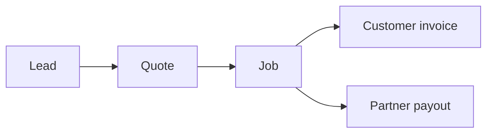
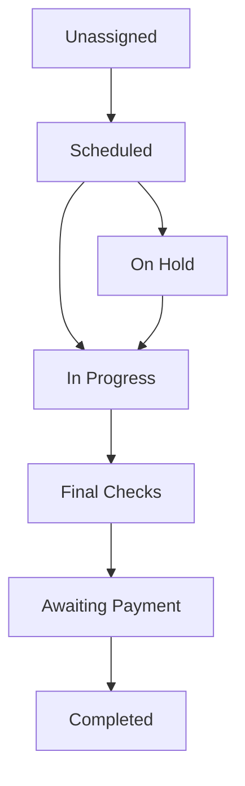
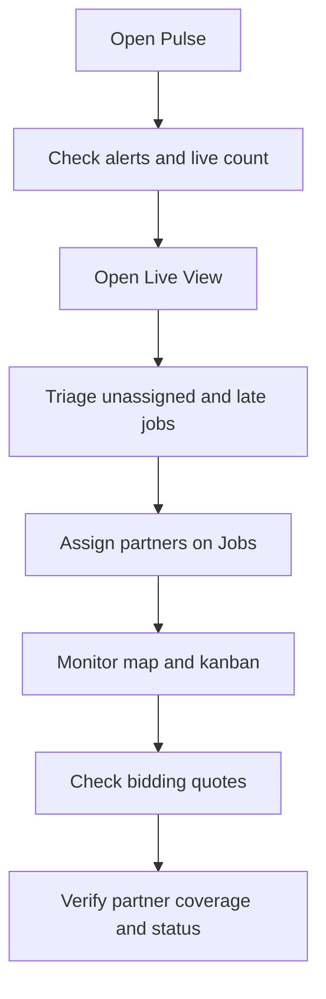

# Fixfy OS — Operations Team Guide

**Who this is for:** Anyone on the Fixfy operations team who uses the internal dashboard day to day — dispatch, account managers, coordinators, and admins. No technical background needed.

**What this covers:** Pulse, Live View, Leads, Quotes, Jobs, Schedule, Accounts, and Partners.

---

## 1. Welcome — how Fixfy fits together

Fixfy OS is your **control centre**. It is where you:

- Track work from first interest through to completion
- Manage corporate clients (Accounts)
- Manage your trade partner network (Partners)
- See what is happening right now (Pulse and Live View)
- Plan ahead (Schedule)

Everything in the system follows a simple commercial path:

| Stage | Plain English |
|-------|----------------|
| **Lead** | Work you offer **to partners** on Fixfy Trade — before a full quote |
| **Quote** | Partner bid → margin check → customer proposal (usually same Zendesk ticket) |
| **Job** | The actual work — scheduled, assigned to a partner, completed, and billed |
| **Invoice** | What the customer pays Fixfy |
| **Payout** | What Fixfy pays the partner (via self-bills) |

---

## 2. The sidebar menu — what each section is for

| Menu item | What it is for | When to open it |
|-----------|----------------|-----------------|
| **Pulse** | Your morning dashboard — KPIs, alerts, live activity | Start of shift; quick health check |
| **Live View** | Real-time triage — list, board, or map of active work | During the day; dispatch and monitoring |
| **Leads** | Work published **to partners** on Fixfy Trade | When you want the network to raise their hand |
| **Quotes** | Partner bid → margin → customer (same ticket) | Most quotes go to partners first, then the customer |
| **Jobs** | Live and completed work | Day-to-day operations; job details and actions |
| **Schedule** | Planning calendar (not the live map) | Capacity planning; seeing the week or month ahead |
| **Accounts** | Corporate clients and their billing | Client management; portal users; payment terms |
| **Partners** | Your trade network | Onboarding, compliance, coverage, assignments |

> **Tip:** *Live View* and *Schedule* sound similar but do different jobs. **Live View** = what is happening now. **Schedule** = what is planned on the calendar.

---

## 3. Pulse — Operations Overview

**Menu:** Pulse (home page)

**Purpose:** One screen to understand how the business is doing today (or this week, month, or quarter).

### What you see

| Section | What it tells you |
|---------|-------------------|
| **Live Operations** | How many jobs are live right now (unassigned, scheduled, in progress), plus scheduled, on hold, and SLA at-risk counts |
| **Financials** | Revenue, costs, margin, and job-level money detail for the selected period |
| **Jobs Forecast** | A 10-day look ahead — how busy each day will be, broken down by job stage |
| **Alerts** | Things that need attention — SLA risk, jobs awaiting payment, low margin, jobs needing attention |
| **Live Board** | A live feed of Jobs, Quotes, or Leads — switch with the tabs at the top |
| **Revenue Trend** | How billed revenue and costs are trending over recent weeks |
| **Top Accounts** | Which client accounts are driving the most value in the period |

### How to use it

1. **Pick a date range** at the top right — Today, This week, This month, Quarter to date, or a custom range. Everything on Pulse respects this filter.
2. **Scan Live Operations** for the headline numbers — especially "live now" and SLA at risk.
3. **Check Alerts** — red or amber items are your action list.
4. **Use the Live Board** to jump into a specific job, quote, or lead without leaving the page.
5. **Review Financials** when you need to understand margin or revenue for the period.

### Key ideas (in plain language)

- **Revenue goal:** A target Fixfy sets for how much should be billed in the period. You can see progress against it in Financials.
- **Margin:** The difference between what the customer pays and what the partner and materials cost. Low margin triggers an alert.
- **SLA at risk:** A job or quote is taking longer than the agreed service level. For quotes in Bidding, this usually means partners have not returned prices fast enough.

---

## 4. Live View — Live Operations

**Menu:** Live View  
**Page title:** Live Operations  
**Also called:** Beacon (you may see this label at the top of the page)

**Purpose:** Triage active work in real time. This is your dispatch desk.

### Three views

Switch between them with the buttons at the top right: **List**, **Kanban**, **Map**.

#### List view

- A filterable table of jobs in the selected date range.
- Good when you want to search, sort, and open job details quickly.

#### Kanban view

- Jobs appear as cards in columns by stage.
- Drag a card to move it to another column (some moves open a confirmation step — for example completing or cancelling a job).

| Column | Meaning |
|--------|---------|
| **Unassigned** | No partner yet (includes jobs that are auto-assigning) |
| **Scheduled** | Partner assigned, visit booked (includes jobs that are late — past arrival time but not started) |
| **In Progress** | Partner is on site or actively working |
| **Final Checks** | Work done; office is reviewing reports (includes jobs that need attention) |
| **Completed** | Job finished and approved |
| **Cancelled** | Job was cancelled |

#### Map view

- A live map of the UK showing **partners** and **jobs**.
- Use filters for date, partner, account, and trade (type of work).
- **Fullscreen** keeps the search bar, filters, and side panels — you still have full control.

### Partners on the map

Only **Active** partners appear.

Each partner marker shows:

| Status | What it means |
|--------|----------------|
| **In job** | Currently working on an active job |
| **Available** | Online and free — no active job right now |
| **Offline** | No signal from the partner app for 15+ minutes |

The small badge on each marker shows the partner's **trade icon** (e.g. plumber, electrician).

**Useful actions:**

- Click a partner in the side panel → the map flies to their location.
- **Back to London** → recentres the map on London.
- **Coverage scout** → enter a postcode, radius, and trade to see which active partners cover that area. Use this before assigning work to a new location.

### Jobs on the map

- Job pins show where work is happening.
- Colour and shape reflect job status.
- Click a pin or a job in the side panel for details.

### Filters

At the top you can filter by:

- **Date** — Today, Tomorrow, This week, This month, etc.
- **Partner** — one partner or all
- **Account** — one corporate client or all
- **Trade** — type of work

---

## 5. Leads

**Menu:** Leads

**Purpose:** Offer work **to your partner network** on Fixfy Trade — **not** a customer enquiry inbox. A lead is an opportunity you want partners to see before you have a formal quote or full price.

> **Think of it this way:** you are **selling the opportunity to partners**, not pitching to the end customer yet.

### Lead statuses

| Status | Meaning |
|--------|---------|
| **New** | Just landed — not yet validated for partners |
| **Interested** | Ops confirmed — ready to publish or already live on Trade |

### Typical workflow

1. **Opportunity lands in Leads** — type of work, location, urgency (often tied to the same Zendesk ticket).
2. **Ops reviews** — is this real work worth offering to the network?
3. **Mark Interested** — confirm it is worth publishing.
4. **Publish to partners** — goes live on **Fixfy Trade**. Only **Active** partners matching **trade**, **coverage**, and lead opt-in see it.
5. **Partners respond** — they tap **Contact** in the Partner app; you see who raised their hand in Fixfy OS.
6. **Create a Quote when ready** — leads never auto-convert; open a quote when you need formal partner pricing or a customer proposal.

### Leads vs Quotes

| | **Lead** | **Quote** |
|---|----------|-----------|
| **Audience** | Partners (Fixfy Trade) | Partners first, then customer |
| **Goal** | “Who wants this job?” | Partner bid → margin → customer proposal |
| **Typical next step** | Create quote | Convert to job |

### Urgency levels

Low, Medium, High, Urgent — signals how fast ops and partners should act.

---

## 6. Quotes

**Menu:** Quotes

**Purpose:** Price a job. **Most often:** send to partner → partner sends price back → you **check margin** → send proposal to customer — all on the **same Zendesk ticket**. You can price manually in the office, but the partner bidding route is the default.

### The usual flow (same ticket)

1. **Create the quote** in Fixfy OS — linked to the Zendesk ticket.
2. **Send to partners (Bidding)** — invite Active partners; they get scope and photos in the **Fixfy Partner app**.
3. **Partner submits a bid** — labour, materials, notes return into the quote.
4. **Review margin** — sell price vs partner cost must meet your margin floor.
5. **Build customer proposal** — PDF / line items from the selected bid.
6. **Send to customer** — **Approval** stage; communication stays on the **same Zendesk ticket**.
7. **Payment → Job** — deposit collected, quote converts to a scheduled job.

### Quote stages (in Fixfy OS)

| Stage | What is happening |
|-------|-------------------|
| **New** | Scope and ticket linked — decide partner bidding vs manual pricing |
| **Bidding** | Partners invited; waiting for bids in the Partner app |
| **Approval** | Customer proposal sent on the Zendesk ticket |
| **Payment** | Customer accepted — deposit or payment pending |
| **Converted to Job** | Won — partner booked |
| **Rejected** | Customer declined or lost |

### Manual quote (less common)

Sometimes ops already knows partner cost and sell price and builds line items **without** a bidding round. Valid, but used **less often** than partner bid → margin → customer.

### Bidding SLA

If a quote sits in **Bidding** too long, Pulse flags **SLA overdue**. Send to the customer as soon as you have enough pricing — you do not need every partner to respond.

---

## 7. Jobs

**Menu:** Jobs Management

**Purpose:** The real work — who is going, when, how much it costs, reports, and invoicing.

### Job statuses

| Status | Meaning | Who usually moves it |
|--------|---------|----------------------|
| **Unassigned** | No partner assigned yet | Ops assigns a partner |
| **Assigning** | System is trying to auto-assign | Automatic |
| **Scheduled** | Partner assigned, visit booked | Ops or partner accepts |
| **Late** | Past scheduled arrival, not started | Flag only — still "scheduled" |
| **In Progress** | Work is underway | Partner starts on site (or ops) |
| **Final Checks** | Partner submitted reports; office reviews | Partner completes; ops approves |
| **Awaiting Payment** | Approved; waiting for customer payment | Ops after approval |
| **Needs Attention** | Something is wrong — review required | Ops |
| **On Hold** | Paused (e.g. access issue, complaint) | Ops |
| **Completed** | Done and paid (or closed) | Ops marks paid |
| **Cancelled** | Job will not go ahead | Ops or partner (with rules) |

### Typical workflow

1. **Job created** — from a quote, request, or manually.
2. **Assign a partner** — pick an Active partner who covers the area and trade. Or use auto-assign.
3. **Partner accepts and attends** — they use the Fixfy Partner app to navigate, start the job, and track time.
4. **Partner submits reports** — start report and final report with photos and notes.
5. **Office reviews** — in Final Checks, ops checks reports and approves.
6. **Invoice the customer** — send report and invoice.
7. **Mark completed** — once payment is received.
8. **Partner payout** — a self-bill is created for the partner (handled in Finance).

### Common actions on a job

- **Assign / change partner**
- **Start job / Complete job** (if doing it from the office)
- **Put on hold** — pauses the job; you can resume later
- **Review & Approve** — moves from Final Checks to Awaiting Payment
- **Mark as Paid** — closes the job
- **Cancel** — stops the job; may affect partner fees depending on timing

### Jobs tabs

The Jobs page has tabs to filter by stage — All, Action Required, Unassigned, Scheduled, In Progress, On Hold, Final Checks, Awaiting Payment, Completed, Cancelled. Use these to focus your queue.

---

## 8. Schedule

**Menu:** Schedule (under Operations)

**Purpose:** A **planning calendar** — see jobs across days, weeks, or months. This is for capacity and planning, not live dispatch.

**Do not confuse with Live View.** The calendar shows pipeline jobs (from action required through final checks). For the live partner map, use **Live View**.

### How to use it

- Switch between year, month, week, or day view.
- See how many jobs fall on each day.
- Click a job to open its details.
- Use this when planning team capacity or spotting overloaded days.

---

## 9. Accounts

**Menu:** Accounts  
**Subtitle:** Manage corporate client accounts and billing.

**Purpose:** Your B2B clients — the companies that hire Fixfy for maintenance and projects.

### What you manage here

| Area | What it is |
|------|------------|
| **Account details** | Company name, billing address, payment terms |
| **Clients** | Individual sites or contacts under the account |
| **Portal users** | People at the client company who log into the **customer portal** to raise requests, view quotes, track jobs, and see invoices |
| **Jobs & invoices** | History linked to this account |
| **Payment terms** | When invoices are due (e.g. Net 30, biweekly) |

### Typical workflow

1. **Create account** when you onboard a new corporate client.
2. **Add clients** (sites/properties) under the account.
3. **Invite portal users** so the client can self-serve.
4. **Link jobs and quotes** to the right account.
5. **Track outstanding invoices** from the account view.

> The **customer portal** is separate from Fixfy OS and from the partner app. Accounts is where you set up who can access it.

---

## 10. Partners

**Menu:** Partners

**Purpose:** Your network of tradespeople — who can receive job invitations, submit bids, and do work.

### Partner statuses

| Status | Meaning |
|--------|---------|
| **Onboarding** | Applied or being set up — not yet eligible for work |
| **Active** | Fully approved — can receive bids and job assignments |
| **Needs Attention** | Compliance or documents need fixing — may still be visible but should be resolved |
| **Inactive** | Not currently working with Fixfy (includes partners on break) |

**Rule:** Only **Active** partners can be invited to bid on quotes or assigned to jobs.

### Partner profile sections

| Tab / area | What it is for |
|------------|----------------|
| **Overview** | Company name, contact name, email, phone, status. Use **Edit name** for a quick name change. |
| **Coverage** | Where the partner works — radius from a base postcode, or specific postcode districts |
| **Documents** | Compliance files — insurance, ID, trade certificates. Drives the compliance score |
| **Jobs** | History of work done for Fixfy |
| **Service rates** | Standard pricing for their trades |
| **Payouts** | Self-bills and payment history |

### Compliance score

A number from 0 to 100 that reflects:

- **Profile completeness** — contact details, address, tax info, coverage area
- **Documents** — required files uploaded and not expired
- **Expired documents** — lower the score

Partners generally need a score of **95 or above** to be activated without special approval.

### Typical partner lifecycle

1. Partner applies via the **Become a Partner** page.
2. Ops reviews application → status **Onboarding**.
3. Partner uploads missing documents (via app or a document upload link you send).
4. Ops checks coverage, trades, and compliance.
5. Activate → status **Active**.
6. Partner receives job invitations and can bid.
7. If documents expire → **Needs Attention** until renewed.
8. If partner stops working → **Inactive**.

### Sending document requests

From a partner's profile you can request specific documents. The partner receives a link to upload files without needing to log into the full app.

---

## 11. How the pieces connect — a day in ops

---

## 12. Glossary

| Term | Meaning |
|------|---------|
| **Pulse** | The home dashboard — operations overview |
| **Live View / Beacon** | Real-time triage page (list, kanban, map) |
| **Lead** | Work offered to partners on Fixfy Trade |
| **Quote** | Partner bid → margin check → customer proposal |
| **Job** | Scheduled and completed work |
| **Account** | A corporate client |
| **Partner** | A trade subcontractor in the Fixfy network |
| **Trade** | Type of work (Plumber, Electrician, etc.) |
| **Bidding** | Partners submitting prices for a quote |
| **SLA** | Agreed time limit — overdue means action needed |
| **Self-bill** | Partner's weekly payment summary |
| **Compliance score** | Partner readiness score (profile + documents) |
| **Coverage** | Geographic area a partner will travel to |
| **Coverage scout** | Map tool to find partners near a postcode |
| **Portal** | Customer-facing site for B2B clients (not the partner app) |

---

## 13. Frequently asked questions

**What is the difference between Live View and Schedule?**  
Live View shows what is happening now (with a live map). Schedule is a calendar for planning ahead.

**Why is a partner on the map but showing Offline?**  
They have not sent a location update from the app in 15+ minutes. They may have closed the app or have poor signal. Their last known position is still shown.

**Why can I not assign a partner to a job?**  
Check their status is **Active**, their coverage includes the job postcode, and their documents are in order.

**Is a Lead a customer enquiry?**  
No. It is work you offer **to partners** on Fixfy Trade. The customer conversation usually stays on Zendesk.

**Does a lead automatically become a quote?**  
No. Create a quote manually when you need partner pricing or a customer proposal.

**What happens when I publish a lead?**  
Matching partners see it on Fixfy Trade. When they tap Contact, you see their name on the lead.

**How do quotes usually work?**  
Send to partner → bid back → check margin → send to customer on the **same Zendesk ticket**. Manual office pricing is less common.

**A quote has been in Bidding for days — what should I do?**  
If you have enough partner prices, check margin and send to the customer on the ticket.

**What does On Hold mean on a job?**  
The job is paused — for example waiting for access, parts, or a complaint resolution. Resume when ready.

**What is Final Checks?**  
The partner has finished on site and submitted reports. Your team reviews and approves before invoicing.

---

*This guide describes Fixfy OS as used by the operations team. For partner-facing instructions, see the Fixfy Trade Partner Guide.*
