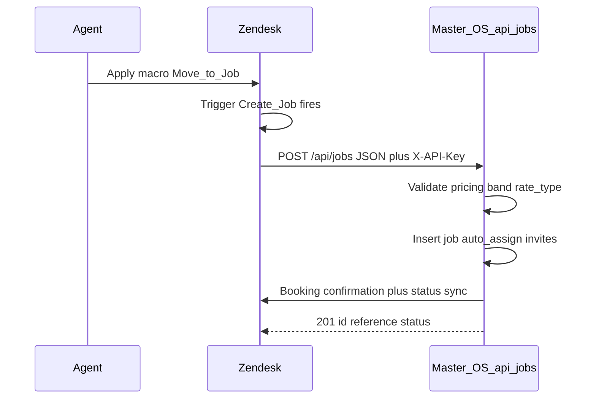

# Zendesk → Master OS: Create Job webhook

How agents move a Zendesk ticket into a Fixfy job using **native Zendesk triggers and webhooks** (Admin Center → Webhooks). There is **no n8n** in this path — Zendesk POSTs JSON directly to the OS API.

For curl examples and env vars see [`API_CURL.md`](API_CURL.md). For the full route inventory see [`API_REFERENCE.md`](API_REFERENCE.md).

---

## Architecture



| Layer | Responsibility |
|-------|----------------|
| **Zendesk form** | Agent fills Type of Work, Rate Type, band (if applicable), client, address, date, arrival window |
| **Zendesk trigger** | Fires when macro/tag conditions match (e.g. after “Move to Job”) |
| **Zendesk webhook** | Liquid template builds JSON body; `X-API-Key` authenticates to OS |
| **`POST /api/jobs`** | Creates job, resolves pricing, geocodes, optional auto-assign, links ticket |
| **Ticket reconcile** | When `ticket_id` is sent, OS can re-read band/client/address from the live ticket if the payload is incomplete |

---

## Production webhooks (Zendesk Admin Center)

All use the same pattern: **Liquid strip of `os_` / `band_` prefixes**, **`ticket_id` always present**, `Content-Type: application/json`.

| Macro / action | Trigger ID | OS endpoint | API key env |
|----------------|------------|---------------|-------------|
| Create or Convert a Job | `5703043672095` | `POST https://app.getfixfy.com/api/jobs` | `MASTER_OS_JOB_WEBHOOK_API_KEY` |
| Create a quote | `5700470769823` | `POST https://app.getfixfy.com/api/quotes` | `MASTER_OS_QUOTE_WEBHOOK_API_KEY` |
| Cancel Job in OS | `5839226314655` | `POST https://app.getfixfy.com/api/cancellations` | `ZENDESK_WEBHOOK_API_KEY` |
| Hold Job in OS | `5839209950111` | `POST https://app.getfixfy.com/api/holds` | `ZENDESK_WEBHOOK_API_KEY` |

Configure each webhook in **Admin Center → Apps and integrations → Webhooks**. Attach the webhook to the matching trigger under **Objects and rules → Triggers**.

---

## Create Job — webhook body (Liquid)

Trigger **`5703043672095`** (Create Job). Endpoint: `https://app.getfixfy.com/api/jobs`.

Headers:

- `Content-Type: application/json`
- `X-API-Key: <MASTER_OS_JOB_WEBHOOK_API_KEY>`

Body template (current production Liquid):

```liquid
{
  "account_id":         "{{ticket.organization.custom_fields.org_id}}",
  "date":               "{{ticket.ticket_field_5693027123999}}",
  "arrival_time":       "{{ticket.ticket_field_5737641586335}}",
  "catalog_service_id": "{{ticket.ticket_field_5687087915551 | remove: 'os_'}}",
  "band_id":            "{{ticket.ticket_field_5853839193247 | remove: 'band_'}}{{ticket.ticket_field_5853837434527 | remove: 'band_'}}{{ticket.ticket_field_5853864806559 | remove: 'band_'}}{{ticket.ticket_field_5853839199903 | remove: 'band_'}}{{ticket.ticket_field_5853819554335 | remove: 'band_'}}{{ticket.ticket_field_5854678454047 | remove: 'band_'}}",
  "client_name":        "{{ticket.ticket_field_5693105918623}}",
  "client_email":       "{{ticket.ticket_field_5811705681183}}",
  "client_phone":       "{{ticket.ticket_field_5811689527071}}",
  "property_address":   "{{ticket.ticket_field_5693026186527}}",
  "description":        "{{ticket.ticket_field_5687121072927}}",
  "client_price":        {{ticket.ticket_field_5703050059039 | default: 0}},
  "hourly_client_rate":  0,
  "rate_type":          "{{ticket.ticket_field_5807260876063 | remove: 'job_type_'}}",
  "auto_assign":         {{ticket.ticket_field_5811578972703}},
  "report_link":        "{{ticket.ticket_field_5754991026207}}",
  "ticket_id":          "{{ticket.id}}"
}
```

### Field mapping (Zendesk → OS)

Canonical field IDs live in [`src/lib/zendesk-os-catalog-mapping.ts`](../src/lib/zendesk-os-catalog-mapping.ts).

| Liquid / ticket field | Field ID | OS payload key | Notes |
|----------------------|----------|----------------|-------|
| Org custom `org_id` | (org field) | `account_id` | `accounts.id` UUID |
| Job Date | `5693027123999` | `date` | Multiple date formats accepted |
| Arrival Window | `5737641586335` | `arrival_time` | Slot tag or `HH:MM` range |
| Type of Work | `5687087915551` | `catalog_service_id` | Strip `os_` → bare UUID |
| EPC / FRA / EICR / PAT / GSC / FAC band | see `` | `band_id` | Strip `band_`; empty for non-banded services |
| Client Name | `5693105918623` | `client_name` | Required |
| Client Email | `5811705681183` | `client_email` | Optional |
| Client Phone | `5811689527071` | `client_phone` | Optional |
| Property Address | `5693026186527` | `property_address` | Required; reconcile from ticket if payload is email |
| Scope / description | `5687121072927` | `description` | → `jobs.scope` |
| Client Price | `5703050059039` | `client_price` | Fixed only; hidden in form when hourly → sends `0` |
| Rate Type | `5807260876063` | `rate_type` | `hourly` or `fixed` (strip `job_type_`). **Required for correct pricing** — see [Empty Rate Type](#empty-rate-type) |
| Auto-Assign | `5811578972703` | `auto_assign` | Boolean |
| Report link | `5754991026207` | `report_link` | Optional URL |
| Ticket id | `{{ticket.id}}` | `ticket_id` | **Always send** — idempotency + reconcile |

### Band field by service (Type of Work UUID)

| Service | `catalog_service_id` | Zendesk band field ID |
|---------|----------------------|------------------------|
| EPC | `06271726-30ca-4f5f-9579-384de83d8ecf` | `5853839193247` |
| FRA | `a1f8b034-28d4-4775-8c47-272df6701aa2` | `5853837434527` |
| EICR | `e0cbd852-c10c-4aac-b52c-dfd274b65848` | `5853864806559` |
| PAT | `7796473e-c22b-4452-a22f-de1b8a87045a` | `5853839199903` |
| GSC (CP12) | `d978384e-d1be-45ef-914a-9172f8d9fe62` | `5853819554335` |
| FAC | `ea6d7f17-1a9b-44ea-87d8-0e9ebf857431` | `5854678454047` |

Hourly trades without bands (Plumber, Electrician, etc.): the `` does not match → `band_id` is `""`. OS treats empty string as absent — **no 400**.

---

## Pricing: one macro, Rate Type decides

| Zendesk `rate_type` | OS `job_type` | UI label | Pricing behaviour |
|---------------------|---------------|----------|-------------------|
| `hourly` | `hourly` | Smart Price | Bands required for banded services; client £ from account rate card; partner £ per partner on auto-assign |
| `fixed` | `fixed` | Fixed Price | Manual `client_price` only; `partner_cost = client_price × (1 − Setup margin%)` — same for all partners |

**You do not need `smart_price` in Zendesk.** OS maps `hourly` (and legacy `smart_price` / `job_type_hourly`) to Smart Price internally — see [`normalizeWebhookRateType`](../src/lib/zendesk-webhook-pricing.ts).

### Smart Price (`hourly`)

- `band_id` required when the catalog service has `pricing_presets` (EPC, FRA, EICR, …).
- `client_price: 0` and `hourly_client_rate: 0` in the webhook are fine — OS resolves from rate cards.
- Partner rates are personalised per partner when `auto_assign: true`.

### Fixed Price (`fixed`)

- Uses manual `client_price` from the ticket field.
- Bands and rate cards are ignored.
- Client Price field is hidden in the Zendesk form when Rate Type = hourly (agent_conditions).

### Empty Rate Type

If the agent leaves **Rate Type** blank on the ticket, the Liquid template sends `rate_type: ""`. OS behaviour:

| Catalog row | OS `job_type` | `billed_hours` |
|-------------|---------------|----------------|
| `pricing_mode: hourly` or `accepts_smart_price: true` (e.g. Gardener, Plumber) | **`hourly`** (inferred) | min **2h** via `resolveInitialBilledHours` |
| Fixed-only service | **`fixed`** (default) | not set — no Smart Price rates |

The **201** response may include `zendesk_corrections: ["inferred_rate_type_hourly_from_catalog"]` or `["rate_type_defaulted_fixed"]`. **Agents should always select Rate Type** on the ticket so pricing matches intent; inference is a safety net, not a substitute for the form field.

When `auto_assign: true` but **no partners match** (trade, coverage, postcode, or slot), the job is created with `status: "unassigned"` and `warning: "no_matching_partners"` — not stuck in `auto_assigning` without invites.

---

## Example payloads

### EICR + 1-bed Flat + Smart Pricing

```json
{
  "account_id": "xxxxxxxx-xxxx-xxxx-xxxx-xxxxxxxxxxxx",
  "date": "27/05/2026",
  "arrival_time": "arrival_morning",
  "catalog_service_id": "e0cbd852-c10c-4aac-b52c-dfd274b65848",
  "band_id": "8b367b73-43c5-4b33-a20a-925bb8aa9ff7",
  "client_name": "Sarah Wilson",
  "client_email": "sarah@example.com",
  "client_phone": "",
  "property_address": "14 Park Lane, London W1K 1BE",
  "description": "EICR for 1-bed flat, up to 8 circuits",
  "client_price": 0,
  "hourly_client_rate": 0,
  "rate_type": "hourly",
  "auto_assign": true,
  "report_link": "",
  "ticket_id": "12345678"
}
```

Expected **201**:

```json
{
  "id": "uuid",
  "reference": "JB-2026-xxxx",
  "status": "auto_assigning",
  "action": "created"
}
```

### Plumber + hourly (no band)

```json
{
  "catalog_service_id": "2cf5b2a1-8c82-47aa-8305-c34697633924",
  "band_id": "",
  "rate_type": "hourly",
  "client_price": 0,
  "ticket_id": "12345678"
}
```

---

## OS processing (code map)

| Step | Module |
|------|--------|
| Auth `X-API-Key` | [`src/app/api/jobs/route.ts`](../src/app/api/jobs/route.ts) |
| Ticket field reconcile | [`src/lib/zendesk-job-ingest.ts`](../src/lib/zendesk-job-ingest.ts) |
| Band + rate_type validation | [`src/lib/zendesk-webhook-pricing.ts`](../src/lib/zendesk-webhook-pricing.ts) |
| Smart / Fixed resolution | [`src/lib/job-pricing-resolver.ts`](../src/lib/job-pricing-resolver.ts) |
| Auto-assign invites | [`src/lib/auto-assign-job-invites.ts`](../src/lib/auto-assign-job-invites.ts) |
| Zendesk lifecycle (confirmation, status) | [`src/lib/zendesk-lifecycle.ts`](../src/lib/zendesk-lifecycle.ts) |

### Idempotency

Same `ticket_id` posted twice → second response returns the existing job with `action: "existing"`.

If a **quote** already exists for that ticket → job is created with `jobs.quote_id` set and quote status `converted_to_job` (`action: "converted_from_quote"`).

### Prefix stripping (OS backup)

Zendesk Liquid already strips `os_` and `band_`. OS also strips these prefixes if present — redundant but safe. Do not rely on OS-only stripping; keep Liquid as source of truth.

---

## Catalog sync (Type of Work + bands)

OS `service_catalog` rows mirror to Zendesk dropdowns as:

- Type of Work: `os_<service_catalog.id>`
- Band options: `band_<preset.id>` on per-service band fields

After catalog changes or deploy:

```bash
npm run verify:zendesk-schema
npm run sync:zendesk-catalog
npm run audit:zendesk-catalog
```

Or from the dashboard: `POST /api/admin/service-catalog/zendesk-sync` with `{"syncBands": true}`.

See [`API_CURL.md`](API_CURL.md) — section *Zendesk catalog sync*.

**Schema:** migrations `202` (`zendesk_option_id`), `219` (`accepts_smart_price`, `catalog_band_label`), optional `220` (smart-price backfill).

---

## Related Zendesk → OS webhooks

### Create quote (`5700470769823`)

`POST /api/quotes` — see [`src/app/api/quotes/route.ts`](../src/app/api/quotes/route.ts).

### Cancel job (`5839226314655`)

`POST /api/cancellations` — cancellation reason + lost revenue. See [`src/app/api/cancellations/route.ts`](../src/app/api/cancellations/route.ts).

### Hold job (`5839209950111`)

`POST /api/holds` — on-hold reason + complaint notes. See [`src/app/api/holds/route.ts`](../src/app/api/holds/route.ts).

### Retry quote notify (stuck bidding)

`POST /api/quotes/:id/retry-notify` — re-sends partner invites when a quote reached `bidding` without `property_address`. Auth: `MASTER_OS_QUOTE_WEBHOOK_API_KEY` or OS staff session.

---

## Troubleshooting

| Symptom | Likely cause | Fix |
|---------|--------------|-----|
| 401 Unauthorized | Wrong or missing `X-API-Key` | Match webhook header to `MASTER_OS_JOB_WEBHOOK_API_KEY` on Vercel |
| 400 band required | Smart Price on EICR/EPC without band | Agent must select band; or ensure `ticket_id` + band on ticket for reconcile |
| 400 invalid `catalog_service_id` | TOW tag not `os_<uuid>` | Run `npm run sync:zendesk-catalog` |
| Job created but wrong address | Email in address field (Checkatrade) | OS reads ticket Property Address field when payload looks like email |
| Duplicate jobs | Missing `ticket_id` in Liquid | Always include `"ticket_id": "{{ticket.id}}"` |
| `accepts_smart_price` column error | Migration 219 not applied | `npm run apply:zendesk-migrations` (needs `DATABASE_URL`) |

Check webhook delivery: **Admin Center → Webhooks → [webhook] → Recent deliveries**.

---

## Agent training

Fixfy School Zendesk guides (webhooks, macros, forms):

- [`public/school/zendesk/guide.en.html`](../public/school/zendesk/guide.en.html)
- [`public/school/zendesk/macros.html`](../public/school/zendesk/macros.html)

Complaint / on-hold macro forms: [`zendesk-complaint-macro-form.md`](zendesk-complaint-macro-form.md).
